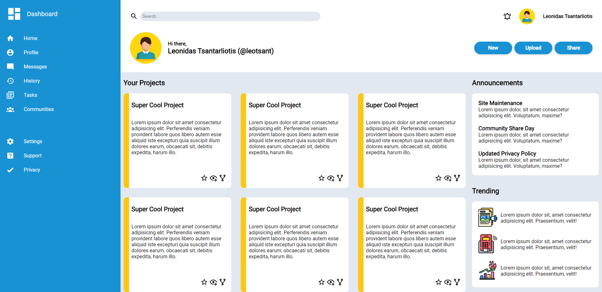

# Admin-Dashboard

Live Demo:
https://leo-tsant.github.io/admin-dashboard/

## Overview

This project was created for the [Admin Dashboard assignment](https://www.theodinproject.com/lessons/node-path-intermediate-html-and-css-admin-dashboard) as part of [The Odin Project](https://www.theodinproject.com/). It is a web-based interface designed to mimic a typical admin panel used for managing a website or application. Built using HTML and CSS, this project showcases advanced layout techniques, including CSS Grid and Flexbox, to create a responsive and visually appealing dashboard.
